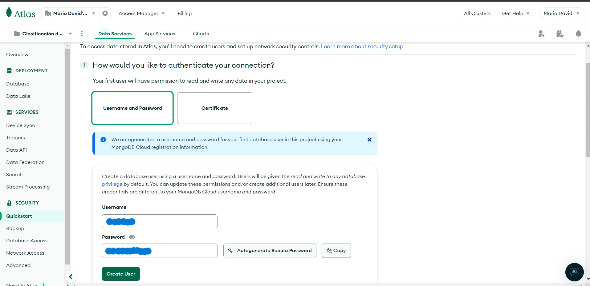
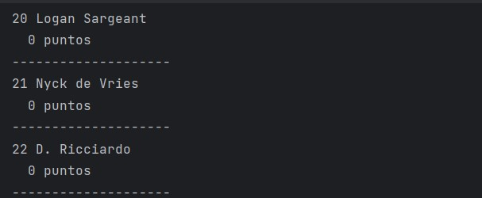

# Prueba Final de Tratamiento de Datos Mario Sigcha
El presente proyecto trata acerca de la extracción de resultados deportivos con el uso de Selenium, en este caso los datos extraídos son los resultados del Campeonato Mundial de la Fórmula 1 y de MotoGP.

El siguiente diagrama muestra el proceso de extraccion de datos de la página Web y la grabación de los datos extraídos en una base de datos MongoDB.


## Instalación de Librerías
Para la instalación de todas las librerías necesarias para el presente proyecto se deben realizar los siguientes pasos:

### Paso 1
Crear un archivo denominado requirements.txt con el siguiente código.
```commandlinem
selenium
pymongo
python-dotenv
```

### Paso 2
Se debe ejecutar el archivo requirements.txt en la consola del proyecto con el siguiente comando.
```commandline
pip install -r requirements.txt
```
Como se muestra en la siguiente imagen.


Se obtiene el siguiente resultado.


## Extracción de Datos
Para la extracción de datos se utilizó Selenium, este es un conjunto de utilidades que facilita la labor de obtener juegos de pruebas para aplicaciones web. Para poder utilizar Selenium se debe importar sus librerías con el siguiente código.
```commandline
from selenium import webdriver
from selenium.webdriver.common.by import By
```
La extracción de datos se encuentra el archivo `main.py`

## Base de Datos MongoDB

Para la conexión a una base de datos MongoDB, se debe importar las librerías de Mongo con el siguiente código.
```commandline
from pymongo.mongo_client import MongoClient
from pymongo.server_api import ServerApi
```
Estas líneas de código se encuentran en el archivo `mongo.py`

## Creación de la Base de Datos MongoDB

### Paso 1
Se debe presionar en el botón `New Project`

### Paso 2
Se coloca un nombre al nuevo proyecto y se presiona en el botón `Next`

### Paso 3
A continuación se presiona en la opción `Create Project`

### Paso 4
Se escoge un plan de pago para la Base de datos, en este caso se escogió la opción gratuita.

### Paso 5
Se debe escoger una autenticación para la conexión a la base de datos, en este caso se utilizó un usuario y contraseña. Se debe guardar este usuario y contraseña.

### Paso 6
Se agrega una lista de direcciones IPs las cuales pueden acceder a la base de datos.

### Paso 7
En este paso la base de datos ya se encuentra creada y configurada.

### Paso 8
Para la conexión debemos copiar el código que nos brinda la base de datos en el lenguaje de programación reuquerido. Es por esto que nos dirijimos a la opción `Overview` y a la opción `CONNECT`.

### Paso 9
Nos dirijimos a la opción `Drivers`, se despliega una ventana en donde en el item 1 escogemos la opción Python con su última versión y en el item 3 se despliega el código necesario para realizar la conexión a la base de datos MongoDb. Dicho código se encuentra en el archivo `mongo.py`.


Una parte del código del archivo `mongo.py` es:
```commandline
user = os.getenv("MONGO_USER")
password = os.getenv("MONGO_PASSWORD")
db_hostname = os.getenv("MONGO_HOST")
uri = f"mongodb+srv://{user}:{password}@{db_hostname}/?retryWrites=true&w=majority"
```
Los datos de `MONGO_USER`, `MONGO_PASSWORD` y `MONGO_HOST` son propios de cada base de datos, estos se agregan a un archivo `.env`.

Un archivo `.env` contiene variables de entorno de usuarios individuales, esto es de suma importancia para que la seguridad de la base de datos no se vea afectada y así ninguna persona tenga acceso a las credenciales de la base de datos. El código del archivo `.env` es el siguiente.
```commandline
MONGO_USER = ********
MONGO_PASSWORD = ********
MONGO_HOST = ********
```

## Resultados

### Impresión de resultados en la consola

#### Clasificación general de pilotos de la Fórmula 1




#### Clasificación general de escuderias de la Fórmula 1


#### Clasificación general de pilotos de Moto GP


#### Clasificación general de escuderias de Moto GP


### Datos grabados en la base de datos MongoDB

#### Datos de Fórmula 1


#### Datos de Moto GP


## Authors
- [masigchamo@uide.edu.ec]()